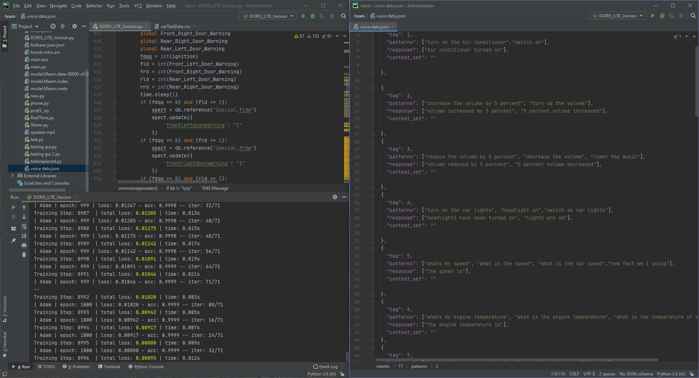
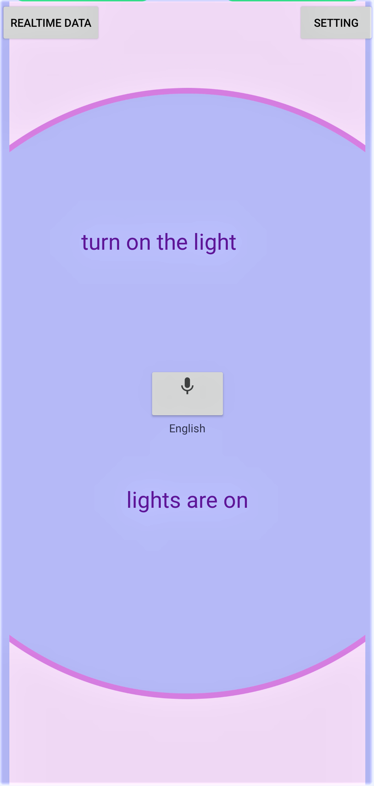
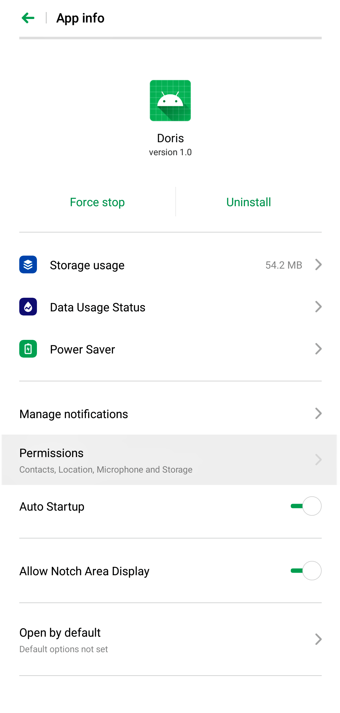
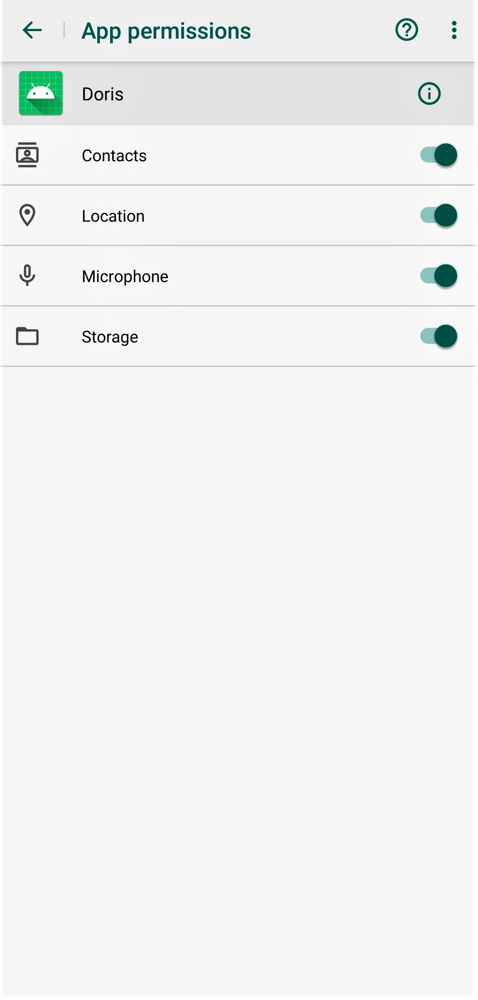
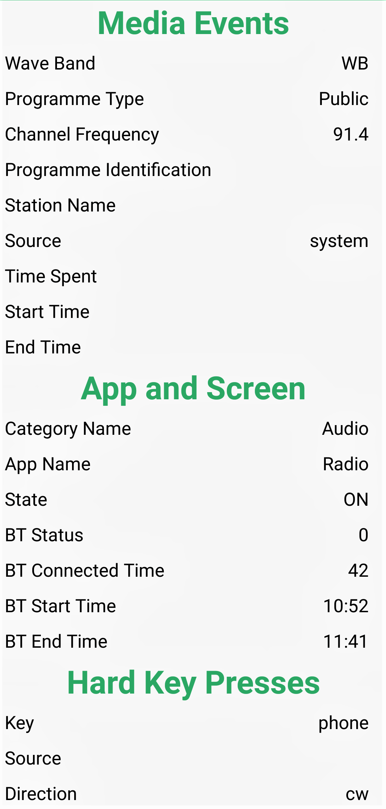
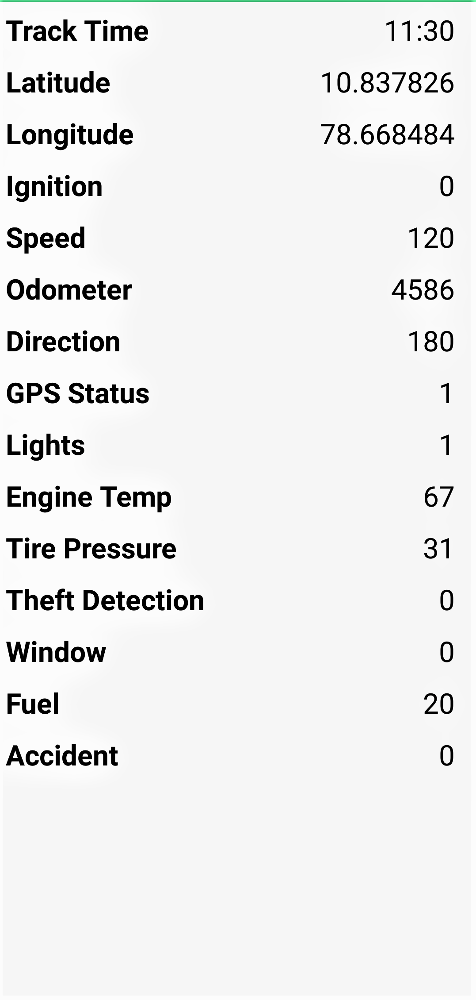
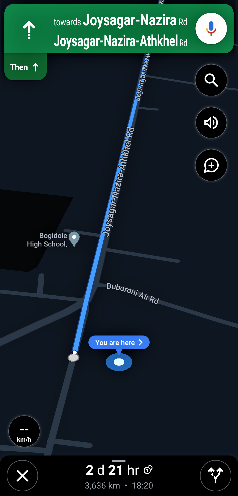
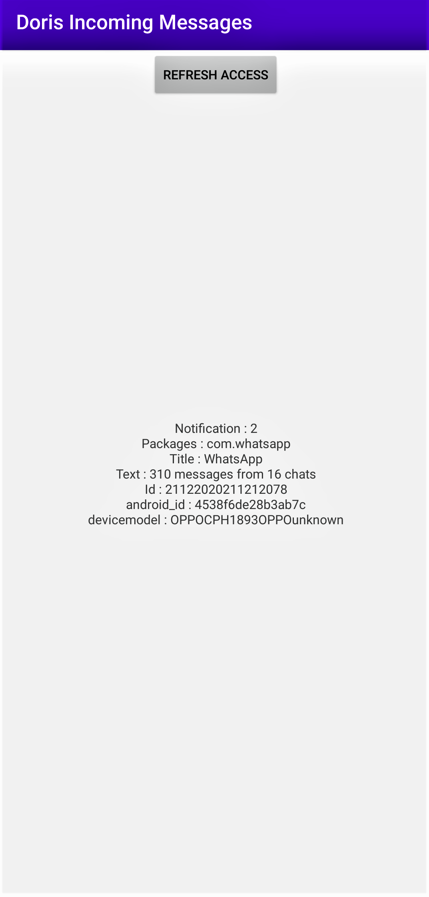

# D.O.R.I.S ( Artificial Intelligent System )


INTRODUCTION
-----------
D.O.R.I.S is an Innovation of The Future which has the optimum capability to create a revolutionary impact in Technological World undoubtedly .
 As a matter of fact, its High time for the Requirement of a Masterpeice like D.O.R.I.S Not only for
the Automibile Industry as It can be implemented  in Healtcare Equipments, Smart Home, Virtual 
Assistant and Many more. Being a Pure standalone Artificial Intelligent Algorithm 
with 99.8% Accuracy and Multi Language Support with Stupefying features,
D.O.R.I.S can never be overlooked 

This repository contains REVISED code and associated files related to DORIS Artificial Intelligent System
 
 * Full Source Code: Available In this Repository Named " **DORIS.zip** "

 * Detailed Product Video Module : https://www.youtube.com/watch?v=p5FuM1xUKGI&feature=youtu.be (part 1)

 * For Bugs and Reports, Contact : innovationbeasts@gmail.com
 
 # D.O.R.I.S Lite ( Artificial Intelligent System )
 
            Keeping it in the mind that the Base Version of the AI we have provided is heavily loaded 
            and may not function properly in some computers or laptops,We Have also developed a Lite Version which 
            can operate smoothly in any computer , for the convenience of the developers at honda.
            The Lite Version also facilitates all the functionalities just as the Mainstream DORIS !!
 
 * Full Source Code: Available In this Repository Named " **DORIS-Lite.rar** "

    

# INSTALLATION

  * The Installation Procedures for both the Mainstream DORIS as well as the DORIS Lite Version is the same. 
  
  First of all Download The Zip Files :
  
  If You Prefer the Lite Version 
  
  ``` bash
     * Full Source Code: Available In this Repository Named " DORIS-Lite.rar "
  ```
   
  If You're Ok With the Mainstream Version 
  
  ``` bash  
   * Full Source Code: Available In this Repository Named " DORIS.zip "
  ```

REQUIREMENTS
------------
Python Packages to Be installed are Listed in requirements.txt File:

```bash
  pip install -r requirements.txt
```

How to Install NLTK
------------------
1) Open Command Prompt
2) ```python
     C:\user\xyz>python 
   ```
3) ```bash
     >>> import nltk
     >>> nltk.download 
   ```
         


4) Click on the Models Tab and select "punkt" and click on the Download Button
5) Wait until the download process is complete

# HOW TO RUN THE PROJECT
  ----------------------
After Completing the downloads of all the dependencies and the installation procedures,

For **DORIS Lite Version** : 
----------------------------

The snippet to execute the project is :

```bash
  python DORIS_LITE_Version.py (or) python3 DORIS_LITE_Version.py
```

### For Mainstream Heavy Loaded  Version :

The snippet to execute the project is :
```bash
python run.py
```
If You have both python version 2 or 3 pre-installed run :
```bash
python3 run.py
```
Note : If The Heavy Version Doesn't work on Your Computer , Checkout with The DORIS Lite Version

# D.O.R.I.S Desktop Application Snapshots:





# D.O.R.I.S ANDROID APPLICATION 


Apart From The Desktop application which represents the In-Car Embedded AI system, we have also developed an Android App
Which functions just like the desktop application.
Link to the APK Files  :

```bash
DORIS ( Base AI ): https://bit.ly/38tejpY
DORIS Connector ( Social Media Message Tracker) :Available In this Repository Named Connector.apk 
```
--> *Enable All The Permissions After Installation*
```bash
Note: Ensure That the Desktop Application is running as the Base AI Engine is laid on it 
```
### Inside The Application

 
 

   
 
 
 

-  From The Settings Select The Language You Prefer
-  For Real Time Data Select the Real Time Data Option in the Top Left Corner. 
Various Real Time Datas Such as Car Location, AC state, Fuel Level and Much more can be accessed through it

