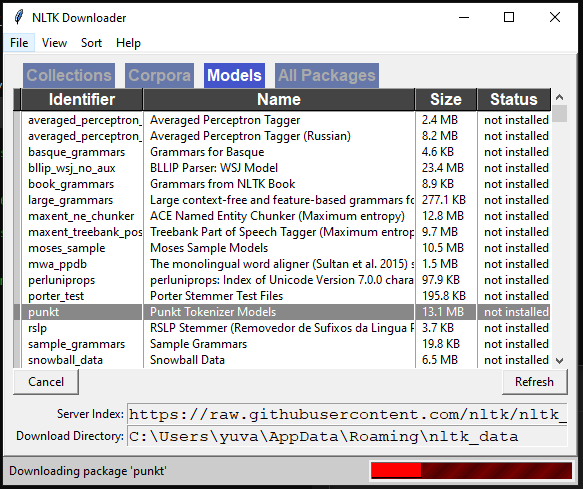

# D.O.R.I.S ( Artificial Intelligent System )


INTRODUCTION
-----------
D.O.R.I.S is an Innovation of The Future which has the optimum capability to create a revolutionary impact in Technological World undoubtedly .
 As a matter of fact, its High time for the Requirement of a Masterpeice like D.O.R.I.S Not only for
the Automibile Industry as It can be implemented  in Healtcare Equipments, Smart Home, Virtual 
Assistant and Many more. Being a Pure standalone Artificial Intelligent Algorithm 
with 99.8% Accuracy and Multi Language Support with Stupefying features,
D.O.R.I.S can never be overlooked 

This repository contains REVISED code and associated files related to DORIS Artificial Intelligent System
 
 * Full Source Code: 

 * Detailed Product Video Module :

 * For Bugs and Reports, Contact : innovationbeasts@gmail.com


REQUIREMENTS
------------
Python Packages to Be installed are Listed in requirements.txt File:
```bash
pip install -r requirements.txt
```

INSTALLATION
------------
The step by step guide is provided  in installation-guide.txt File:
```bash
pip install -r installation-guide.txt
```
How to Install NLTK
------------------
1) Open Command Prompt
2) ```bash
     python```
3) ```bash
         >>> import nltk
         >>> nltk.download```
         


4) Click on the Models Tab and select "punkt" and click on the Download Button
5) Wait until the download process is complete

HOW TO RUN THE PROJECT
----------------------
After Completing the downloads of all the dependencies and the installation procedures,
The Next step i.e. the procedure to execute the project is :
```bash
python main.py
```
If You have both python version 2 or 3 pre-installed run :
```bash
python3 main.py
```

# D.O.R.I.S ANDROID APPLICATION 
----------------------

Apart From The Desktop application which represents the In-Car Embedded AI system, we have also developed an Android App
Which functions just like the desktop application.
Link to the APK Files  :

```bash
DORIS ( Base AI ): 
DORIS Connector ( Social Media Message Tracker) :
```
--> *Enable All The Permissions After Installation*
```bash
Note: Ensure That the Desktop Application is running as the Base AI Engine is laid on it 
```
### Inside The Application

-  From The Settings Select The Language You Prefer
-  For Real Time Data Select the Real Time Data Option in the Top Left Corner. 
Various Real Time Datas Such as Car Location, AC state, Fuel Level and Much more can be accessed through it

